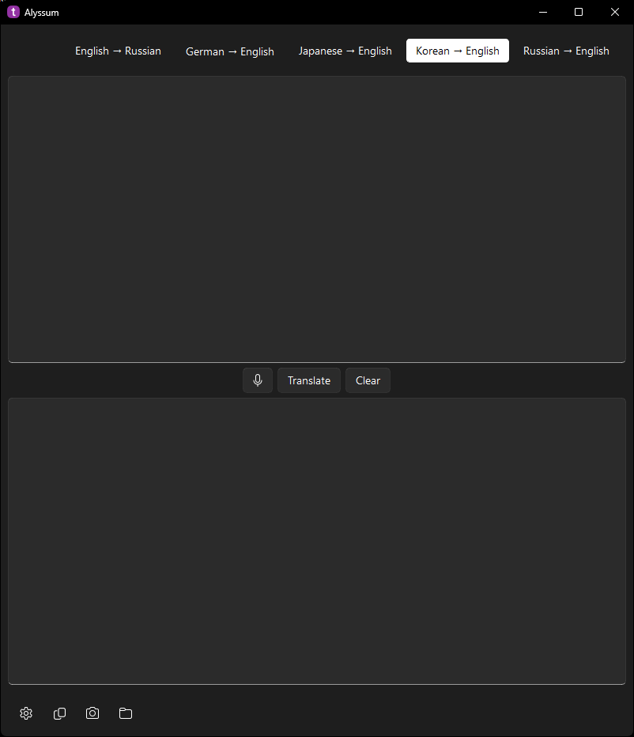
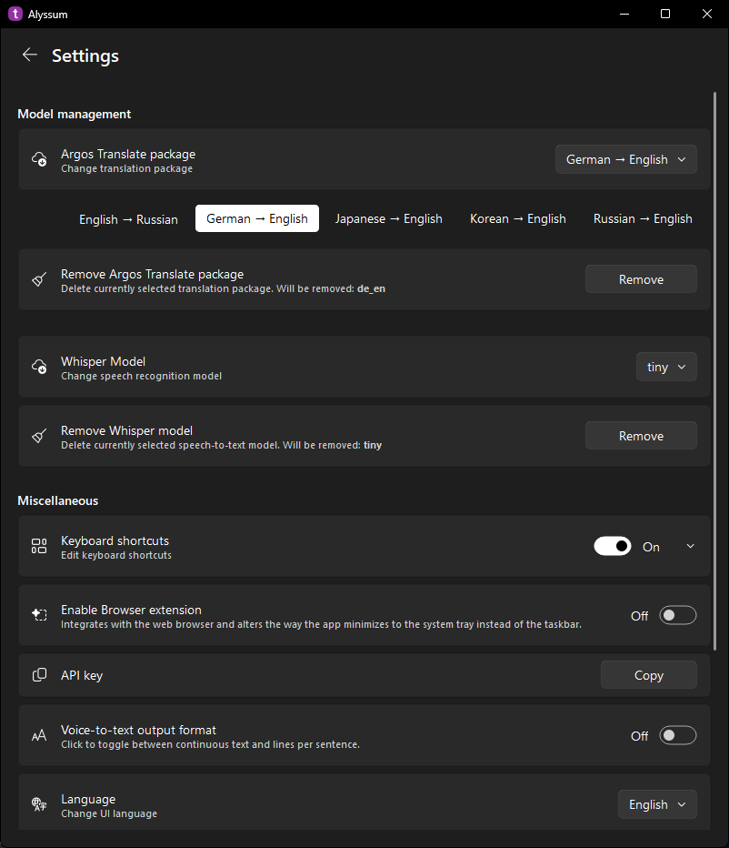

An offline translator built on **Argos Translate** and **Tesseract OCR**.

> **Alyssum** is an offline translator that combines the power of [Argos Translate](https://github.com/argosopentech/argos-translate) with [Tesseract OCR](https://github.com/tesseract-ocr/tesseract).  
> Translate text, documents, books, and even on-screen content — all without an internet connection.  
> Privacy-friendly and designed for quick everyday use.

## License

**Alyssum** is licensed under the [GNU Affero General Public License v3.0](./LICENSE).  
You are free to use, modify, and distribute it under the terms of the AGPL-3.0-or-later.

This software also contains third-party components released under various open-source
licenses. Their license texts are provided in the [licenses/](./licenses) directory.

## Features

- **Languages** – Supports all [languages available](https://github.com/argosopentech/argos-translate?tab=readme-ov-file#supported-languages) in Argos Translate.
- **OCR Support** – Integrated Google Tesseract engine.
- **Configurable Shortcuts** –  
  Default keys:  
  - **F1** – Launch OCR  
  - **F2** – Translate  
  - **F3** – Clear windows  
  - **F5** – Copy translation to clipboard  
  - **F6** – Translate files  
  All shortcuts can be remapped in Settings.  
  > **Note:** Shortcuts are disabled by default; enable them in Settings.
- **File Translation** – Supports: `.txt`, `.odt`, `.odp`, `.docx`, `.pptx`, `.epub`, `.html`, `.srt`, `.pdf`.
- **WebExtension** – Translate any selectable text in your browser without manual copying.

## Contents

- [Getting Started](#getting-started)
- [Building .EXE](#building-exe)
- [Translation Packages](#translation-packages)
- [Tesseract Models](#tesseract-models)
- [GPU Acceleration](#gpu-acceleration)
- [Browser Extension](#browser-extension)
- [Registry entries (Windows)](#registry-entries-windows)
- [Acknowledgments, Licenses and Third-Party Software](#acknowledgments-licenses-and-third-party-software)
- [Screenshots](#screenshots)

---

## Getting Started

### Prerequisites

1. [Python 3.12](https://www.python.org/downloads/release/python-3129/)
2. [Git](https://git-scm.com/downloads)
3. Windows
4. NVIDIA GPU with CUDA 12.6 support *(optional, for GPU acceleration)*

### Installation

1. Clone the repository:
   ```bash
   git clone https://github.com/icosane/Alyssum.git
   ```
2. Navigate to the folder and create a virtual environment:
   ```bash
   python -m venv .
   ```
3. Activate the virtual environment:
   ```bash
   .\Scripts\activate
   ```
4. Install requirements:
   ```bash
   pip install -r requirements.txt
   ```
5. Download [Tesseract Portable](https://u.pcloud.link/publink/show?code=XZHY53VZxzxv8qvcTUJ4fzLHJhwvbh7ee1Nk) or [Tesseract](https://github.com/UB-Mannheim/tesseract/wiki) and place it into:
   ```
   ./AlyssumResources/tesseract
   ```
   Recommended structure:
   ```
   tesseract/
   ├── bin/
   ├── include/
   ├── lib/
   └── share/
       ├── man/
       └── tessdata/
   ```
   If needed, adjust the `TesseractManager` search paths in `config.py`.

   **Tip:** You can also open the folder in [Visual Studio Code](https://code.visualstudio.com/download) or [VSCodium](https://github.com/VSCodium/vscodium/releases), install the Python extension, then press `Ctrl+Shift+P` → **Python: Create Environment** → `.venv` → select `requirements.txt`.

6. Enable UTF-8 support in Windows *(recommended for files with non-Latin characters)*:  
   - **Settings** → **Time & language** → **Language & region** → **Administrative language settings** → **Change system locale**  
   - Check **Beta: Use Unicode UTF-8 for worldwide language support**  
   - Reboot for changes to apply.

---

## Building .EXE

1. Install PyInstaller:
   ```bash
   pip install pyinstaller
   ```
2. Run:
   ```bash
   pyinstaller build.spec
   ```

*(The `build.spec` file is included in the repository.)*

---

## Translation Packages

Download Argos Translate packages via the Settings page, or manually from [here](https://www.argosopentech.com/argospm/index/).

For manual install extract the folder into:
```
AlyssumResources/models/argostranslate/data/argos-translate/packages
```

Example structure:
```
AlyssumResources
└── models
    └── argostranslate
        └── data
            └── argos-translate
                └── packages
                    ├── translate-en_fr-1.9
                    │   ├── model
                    │   ├── stanza
                    │   ├── metadata.json
                    │   ├── README.md
                    │   └── config.json
                    └── en_de
                        ├── model
                        ├── stanza
                        ├── metadata.json
                        ├── README.md
                        └── config.json
```
Folder naming: `langfrom_langto` or `translate-langfrom_langto-version`.

---

## Tesseract Models

Get models from:
- [tessdata_fast (faster, slightly less accurate)](https://github.com/tesseract-ocr/tessdata_fast)
- [tessdata (more accurate, slower)](https://github.com/tesseract-ocr/tessdata)

Place them into:
```
AlyssumResources/tesseract/share/tessdata
```

---

## GPU Acceleration

If CUDA is available, the app will automatically detect and use it for faster translation.

---

## Browser Extension

### Chrome
1. Enable **Developer mode** in Extensions and load the `alyssum-ext` folder as **Unpacked**,  
   **OR**  
   Set `chrome://flags/#extension-mime-request-handling` to **Always prompt for install**,  
   then drag `chrome.crx` into Chrome.

   **OR**  
   Go to your extensions page in Google Chrome. You can find it in the Tools -> Extensions menu or by using the following URL:`chrome://extensions`. Drag and drop `chrome.crx` into  this window to install it.

   > **Note:** Chrome may prevent you from running the installed extension because it was not obtained from the Chrome Web Store. In this situation, please use the **first** method (**load as unpacked**)

### Firefox
1. Go to `about:config`
2. Search for `xpinstall.signatures.required`
3. Set to `false`
4. Open **Add-ons Manager**, click the settings button → **Install Add-on from File**
5. Select `firefox.xpi`

After installation, go to the app settings, copy the API key, and paste it into the extension settings.
> **Note:** The API key only needs to be set once.

---

## Registry entries (Windows)
The application saves the window size, position, and API key in the system registry. To clear these settings, simply delete the following registry key:
```
HKEY_CURRENT_USER\Software\icosane\Alyssum
```
---

## Acknowledgments, Licenses and Third-Party Software

This project uses the following libraries and components, which may be licensed under open-source or proprietary terms.  
Full license texts for each component are included in the [licenses/](./licenses) directory.

### Core Libraries
- [Argos Translate](https://github.com/argosopentech/argos-translate) - Machine translation library, licensed under the [MIT License](./licenses/argos-translate-LICENSE.txt)
- [Tesseract OCR Engine](https://github.com/tesseract-ocr/tesseract) - an OCR engine, licensed under the [Apache License 2.0](./licenses/tesseract-LICENSE.txt)
- [QFluentWidgets](https://github.com/zhiyiYo/PyQt-Fluent-Widgets) - a fluent design widgets library, licensed under the [GNU General Public License v3.0](./licenses/PyQt-Fluent-Widgets-LICENSE.txt) 
- [argos-translate-files](https://github.com/LibreTranslate/argos-translate-files) - File translation via Argos Translate, licensed under the [GNU Affero General Public License v3.0](./licenses/argos-translate-files-LICENSE.txt) 
- [PyQt5](https://pypi.org/project/PyQt5/) - Python bindings for Qt v5, licensed under the [GNU General Public License v3.0](./licenses/PyQt-LICENSE.txt) 
- [Flask](https://pypi.org/project/Flask/) - Micro web framework,  licensed under the [BSD 3-Clause License](./licenses/flask-LICENSE.txt) 

### Supporting Libraries & Tools
- [langdetect](https://github.com/Mimino666/langdetect) - Language detection, licensed under the [Apache License 2.0](./licenses/langdetect-LICENSE.txt)
- [pytesseract](https://github.com/madmaze/pytesseract) - a Python wrapper for Google Tesseract, licensed under the [Apache License 2.0](./licenses/pytesseract-LICENSE.txt) 
- [opencv-python](https://github.com/opencv/opencv-python) - a library for computer vision and image processing, licensed under the [MIT License](./licenses/opencv-python-LICENSE.txt)
- [pyautogui](https://github.com/asweigart/pyautogui) - GUI automation, licensed under the [BSD 3-Clause License](./licenses/pyautogui-LICENSE.txt)
- [pillow](https://github.com/python-pillow/Pillow) - Python Imaging Library, licensed under the [MIT-CMU License](./licenses/pillow-LICENSE.txt) 
- [nvidia-cuda-runtime](https://pypi.org/project/nvidia-cuda-runtime-cu12/) - GPU runtime, licensed under the [NVIDIA EULA](./licenses/nvidia-EULA.pdf) 
- [nvidia-cudnn](https://pypi.org/project/nvidia-cudnn-cu12/) - Deep learning acceleration, licensed under the [NVIDIA EULA](./licenses/nvidia-EULA.pdf) 
- [nvidia-cublas](https://pypi.org/project/nvidia-cublas-cu12/) - GPU BLAS library, licensed under the [NVIDIA EULA](./licenses/nvidia-EULA.pdf) 
- [PyInstaller](https://pyinstaller.org/) - bundles a Python application and all its dependencies into a single package. Licensed under the [GPL 2.0 License and the Apache License 2.0](./licenses/pyinstaller-COPYING.txt) 
- [waitress](https://pypi.org/project/waitress/) - WSGI server, licensed under the [Zope Public License (ZPL) 2.1](./licenses/waitress-LICENSE.txt)   
- [jsonify](https://pypi.org/project/jsonify/) - CSV-to-JSON converter, licensed under the [MIT License](./licenses/jsonify-LICENSE.txt)
- [pytorch](https://github.com/pytorch/pytorch) - Deep learning framework, licensed under the [pytorch License](./licenses/pytorch-LICENSE.txt)

### Resources & References
- [Tesseract portable](https://forum.powerbasic.com/forum/user-to-user-discussions/powerbasic-for-windows/826079-portable-tesseract)
- [Letter T icons](https://www.flaticon.com/free-icons/letter-t) by Luch Phou – Flaticon
- [Sl-Alex for ShortcutEdit](https://sl-alex.net/gui/2022/08/21/shortcutedit_capturing_shortcuts_in_pyqt/)

**This software contains source code provided by NVIDIA Corporation.**

> **NOTE**: This software depends on packages that may be licensed under different open-source or proprietary licenses.
---

## Screenshots

**Main Window**  
  

**Settings**  
  

**OCR in action**  

