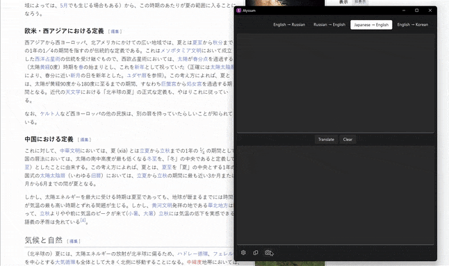

A simple GUI for Argos Translate.

## Features

- **Languages**: Support for most Argos Translate packages (new ones need manual adding to the list)
- **OCR support**: Integrated Google Tesseract engine
- **Configurable shortcuts**: By default you can use F1 to launch OCR, F2 to translate, F3 to clear windows, F5 to copy translation to the clipboard. All of them are remappable in settings. (Shortcuts are disabled by default, enable in settings)

## Getting Started

### Prerequisites

1) [Python 3.12](https://www.python.org/downloads/release/python-3129/)
2) [Git](https://git-scm.com/downloads)
3) Windows

### Installation

1. Clone the repository:
   ```bash
   git clone https://github.com/icosane/Alyssum.git
   ```

2. Navigate to the folder and create a virtual environment:
    ```bash
    python -m venv .
    ```
3. Activate the virtual environment:
    ```
    .\\Scripts\\activate
    ```
4. Install the requirements from the file: 
    ```
    pip install -r requirements.txt
    ```

5. Download [Tesseract Portable](https://u.pcloud.link/publink/show?code=XZHY53VZxzxv8qvcTUJ4fzLHJhwvbh7ee1Nk) or [Tesseract](https://github.com/UB-Mannheim/tesseract/wiki) and place it into ```./AlyssumResources/tesseract```   
I prefer the first option, which has the following file structure:
    ```
    tesseract/
    ├── bin/
    ├── include/
    ├── lib/
    └── share/
        ├── man/
        └── tessdata/
    ```
    You may need to modify the ```TesseractManager``` class in ```config.py``` to update the directories it searches.

You can also open the extracted folder in [Visual Studio Code](https://code.visualstudio.com/download) / [VSCodium](https://github.com/VSCodium/vscodium/releases), install Python extension, then press ```Ctrl+Shift+P```, type ```Python: Create Environment```, select ```.venv```, use ```requirements.txt``` and wait for the process to complete.

### Building .EXE
1. Install PyInstaller in your .venv:
```pip install pyinstaller```
2. Run ```pyinstaller build.spec```

## Acknowledgments
- [QFluentWidgets](https://github.com/zhiyiYo/PyQt-Fluent-Widgets)
- [Argos Translate](https://github.com/argosopentech/argos-translate)
- [Tesseract OCR Engine](https://github.com/tesseract-ocr/tesseract)
- [PyQt5](https://pypi.org/project/PyQt5/)
- [langdetect](https://github.com/Mimino666/langdetect)
- [pytesseract](https://github.com/madmaze/pytesseract)
- [opencv-python](https://github.com/opencv/opencv-python)
- [pyautogui](https://github.com/asweigart/pyautogui)
- [pillow](https://github.com/python-pillow/Pillow)
- [PyInstaller](https://pyinstaller.org/)
- [Tesseract portable](https://forum.powerbasic.com/forum/user-to-user-discussions/powerbasic-for-windows/826079-portable-tesseract)
- [Letter t icons](https://www.flaticon.com/free-icons/letter-t) - Letter t icons created by Luch Phou - Flaticon
- [Sl-Alex for ShortcutEdit](https://sl-alex.net/gui/2022/08/21/shortcutedit_capturing_shortcuts_in_pyqt/)

## Screenshots
<div style="display: flex; flex-direction: column;">
    <p><center>Main Window</center></p>
    
    <p><center>Settings</center></p>
    
    <p><center>OCR in action</center></p>
    
</div>

